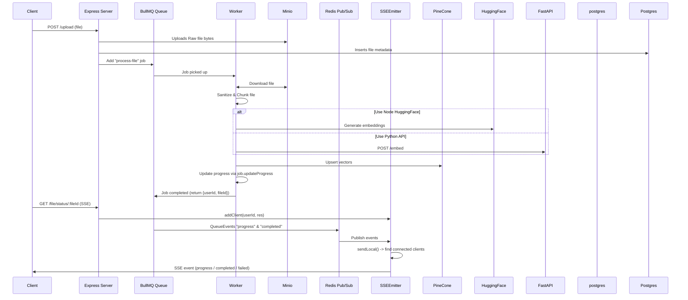

# 📄 AI Document Q&A App

This project is an **AI-powered document assistant** that allows users to upload documents and interact with them through a chatbot interface.

Users can ask natural language questions about the uploaded documents, and the chatbot provides relevant answers based on the document content.

---

## 🚀 Features

- **Document Upload** – Users can securely upload PDF, DOCX, and text files.
- **AI-Powered Q&A** – Chatbot answers questions using the uploaded documents as context.
- **File Processing Pipeline** – Documents are parsed, chunked, and embedded for efficient retrieval.
- **Contextual Search** – Uses embeddings + vector search to fetch the most relevant passages.
- **Chat Interface** – Natural conversation flow with memory for follow-up questions.
- **Cloud Storage** – Files are stored in S3-compatible storage (AWS S3 / Cloudflare R2).
- **Dockerized** – Fully containerized for easy deployment.

---

## 🛠️ Tech Stack

- **Backend**: Node.js (TypeScript, Express)
- **AI/LLM**: OpenAI API / local LLMs
- **Vector Store**: PostgreSQL + pgvector / Pinecone / Weaviate / ChromaDB
- **Storage**: S3 / Cloudflare R2
- **Frontend**: React / Vue (chat interface)
- **Containerization**: Docker & Docker Compose

---

## file upload flow



---

## Product features

## ✅ Completed Features

- [x] **User Auth**
  - Implemented login/signup with **JWT-based auth**
  - Protected routes using `express-jwt`
  - Middleware `requireAuth` in place for secure API endpoints
- [x] **File Upload**
  - Users can upload files via `/upload`
  - Multer integration for handling file uploads
  - Files saved and queued for processing
- [x] **Queue System**
  - Basic file queue implemented
  - Worker picks files for processing
- [x] **File Processing Logic**
  - Extract text, sanitise content, and prepare for downstream use
- [x] **Database Storage**
  - Save processed file metadata into Postgres
- [x] Server sent event setup
  - [x] the client can open a SSE connection to the server
  - [x] The client receives the message from the server once the file is processed/failed
- [x] **Job Status Tracking**
  - [x] Users can query file/job status (queued, processing, done, error)
- [x] **Document Question-Answer Flow**
  - User submits a question related to their uploaded files
  - Backend embeds the question using **Ollama embedding model**
  - Query Pinecone for most relevant document chunks (`top-k`)
  - Send retrieved chunks + question to LLM for generating the answer
  - Return the answer to the user via API or WebSocket
  - Ensure **multi-user isolation** using `userId` metadata filter in Pinecone
- [x] **WebSocket Authentication**
  - Secure socket connections for chat functionality
  - Approach:
    - Client includes `JWT` in WS connection (`?token=xxx`)
    - On `connection`, server verifies token using `verifyJwt`
    - Attach user to socket context for authenticated messaging

## 🚧 In Progress / Next Steps

## 📝 Backlog / Future Features

- [ ] **Token Refresh Flow**
  - Add refresh tokens to reduce login frequency
- [ ] **Chat Functionality**
  - Real-time interaction with processed documents
- [ ] Retry logic for failed file uploads, embedding and upserts to pinecone
- [ ] **Role-based Access**
  - Different user roles (e.g., admin vs regular users)
- [ ] **Monitoring & Logging**
  - Add request logging, error tracking, and metrics

---

## 📦 Setup

```bash
# Clone repo
git clone <repo-url>
cd ai-doc-qa-app

# Install dependencies
npm install

# Start services
docker-compose up --build


## for dev
docker-compose -f docker-compose.dev.yml up --build -d

## for prod
docker-compose up --build -d


## for stopping
docker-compose down

## migrations
docker compose run --rm backend npx node-pg-migrate up
docker compose -f docker-compose.dev.yml run --rm backend npx node-pg-migrate up

## python embedding endpoint
pip install -r requirements.txt
cd llm_service
uvicorn main:app --port 8000
```
