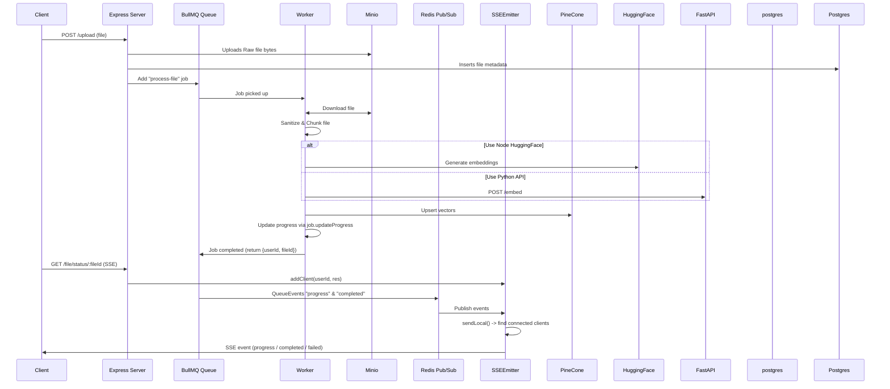
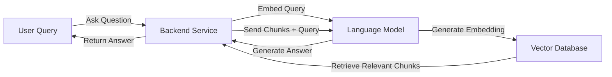
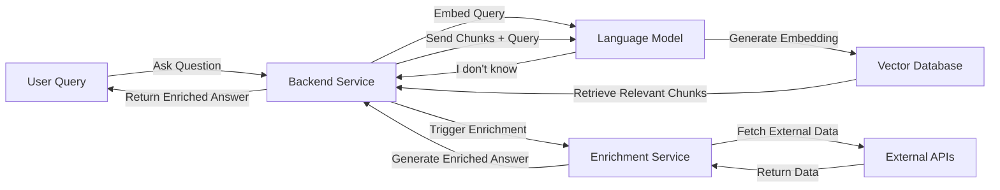
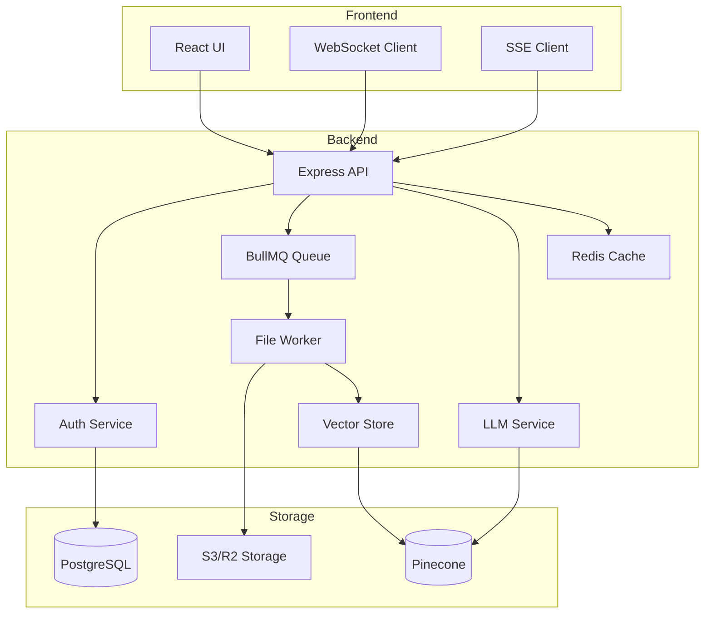

# 📄 AI Legal Document Q&A App

This project is an **AI-powered document assistant** that allows users to upload documents and interact with them through a chatbot interface.

Users can ask natural language questions about the uploaded documents, and the chatbot provides relevant answers based on the document content.

## Overview

The **AI Legal Document Q&A App** project is a service designed to enable users to interact with their documents using natural language queries. It leverages advanced AI capabilities, such as language models and vector-based search, to provide intelligent insights and summaries from user-uploaded documents. The project integrates multiple services to process, store, and retrieve information efficiently.

## Key Features

1. **Document Upload and Processing**:
   - Users can upload documents, which are processed and stored in a vectorized format for efficient retrieval.
   - The system supports chunking and sanitization of text for better handling of large documents.

2. **Natural Language Querying**:
   - Users can ask questions or make queries about their documents in natural language.
   - The system uses AI models to understand the query and retrieve relevant information.

3. **Summarization**:
   - The service can summarize documents or specific sections based on user queries.
   - Summarization is powered by a language model (LLM) and supports chunk-based processing for scalability.

4. **Vector-Based Search**:
   - Documents are stored as vectors in a vector database (e.g., Pinecone or PostgreSQL).
   - This allows for efficient similarity-based search and retrieval of relevant document sections.

5. **Data Enrichment**:
   - The system enriches document data by extracting key insights, legal clauses, or other structured information.

6. **Authentication and Security**:
   - User authentication ensures secure access to documents and queries.
   - The system includes protections against malicious inputs, such as SSRF and private IP access.

## Core Services

1. **Vector Store Service**:
   - Handles the storage and retrieval of vectorized document data.
   - Supports integration with vector databases like Pinecone or PostgreSQL.

2. **LLM Service**:
   - Provides AI capabilities for summarization, text generation, and enrichment.
   - Handles chunking of text and token management for efficient processing.

3. **Deep Research Service**:
   - Focuses on advanced querying and summarization tasks.
   - Integrates with the LLM and prompt services to generate detailed insights.

4. **Prompt Service**:
   - Generates structured prompts for interacting with the language model.
   - Handles text sanitization and formatting.

5. **Fetch Service**:
   - Fetches and processes external HTML content for enrichment or research purposes.

6. **Authentication Service**:
   - Manages user authentication and token generation for secure access.

## Use Case

Imagine a user uploads a legal document and asks, "What are the key obligations mentioned in this document?" The system:

1. Processes and vectorizes the document.
2. Uses the vector store to retrieve relevant sections.
3. Summarizes the obligations using the LLM.
4. Returns a concise and accurate response to the user.

## Goal

The **AI Legal Document Q&A App** project aims to simplify document interaction by combining AI-powered natural language understanding, vector-based search, and summarization. It is ideal for users who need quick insights from large or complex documents, such as legal contracts.

---

## 🚀 Features

- **Document Upload** – Users can securely upload PDF, DOCX, and text files.
- **AI-Powered Q&A** – Chatbot answers questions using the uploaded documents as context.
- **File Processing Pipeline** – Documents are parsed, chunked, and embedded for efficient retrieval.
- **Contextual Search** – Uses embeddings + vector search to fetch the most relevant passages.
- **Chat Interface** – Natural conversation flow with memory for follow-up questions.
- **Cloud Storage** – Files are stored in S3-compatible storage (AWS S3 / Cloudflare R2).
- **Dockerized** – Fully containerized for easy deployment.

---

## 🛠️ Tech Stack

- **Backend**: Node.js (TypeScript, Express)
- **AI/LLM**: OpenAI API / local LLMs
- **Vector Store**: PostgreSQL + pgvector / Pinecone / Weaviate / ChromaDB
- **Storage**: S3 / Cloudflare R2
- **Frontend**: React / Vue (chat interface)
- **Containerization**: Docker & Docker Compose

---

## file upload flow



---

## User Query Flow



## Handling Unknown Answers



---

## Product features

## ✅ Completed Features

- [x] **User Auth**
  - Implemented login/signup with **JWT-based auth**
  - Protected routes using `express-jwt`
  - Middleware `requireAuth` in place for secure API endpoints
- [x] **File Upload**
  - Users can upload files via `/upload`
  - Multer integration for handling file uploads
  - Files saved and queued for processing
- [x] **Queue System**
  - Basic file queue implemented
  - Worker picks files for processing
- [x] **File Processing Logic**
  - Extract text, sanitise content, and prepare for downstream use
- [x] **Database Storage**
  - Save processed file metadata into Postgres
- [x] Server sent event setup
  - [x] the client can open a SSE connection to the server
  - [x] The client receives the message from the server once the file is processed/failed
- [x] **Job Status Tracking**
  - [x] Users can query file/job status (queued, processing, done, error)
- [x] **Document Question-Answer Flow**
  - User submits a question related to their uploaded files
  - Backend embeds the question using **Ollama embedding model**
  - Query Pinecone for most relevant document chunks (`top-k`)
  - Send retrieved chunks + question to LLM for generating the answer
  - Return the answer to the user via API or WebSocket
  - Ensure **multi-user isolation** using `userId` metadata filter in Pinecone
- [x] **WebSocket Authentication**
  - Secure socket connections for chat functionality
  - Approach:
    - Client includes `JWT` in WS connection (`?token=xxx`)
    - On `connection`, server verifies token using `verifyJwt`
    - Attach user to socket context for authenticated messaging
- [x] **Redis Integration**
  - Connected Redis for pub/sub and chat history storage
  - `rPush` used for appending messages, with expiry to auto-clean old history
  - Pub/Sub channels reused for SSE notifications
- [x] **Chat Functionality**
  - Real-time interaction with processed documents
  - Use Redis-based chat history instead of in-memory storage
  - Stream answers via SSE or WebSocket
- [x] **Vector Store Optimization**
  - Include metadata fields: jurisdiction, domain, effectiveDate, source URL
  - Consider embedding new chunks on-the-fly for unanswered questions
  - Support summarization of low-relevance chunks
  - Maintain `topK` retrieval logic for high-relevance context
- [x] **Production-ready Prompt & LLM Instructions**
  - Implement prompt templates for legal domain
  - Include chat history and context trimming for token limits
  - Ensure LLM only answers based on retrieved context

## 🚧 In Progress / Next Steps

- [ ] Retry logic for failed file uploads, embedding, and upserts to Pinecone
- [ ] **Token Refresh Flow**
  - Add refresh tokens to reduce login frequency

## 📝 Backlog / Future Features

- [ ] **Role-based Access**
  - Different user roles (e.g., admin vs regular users)
- [ ] **Monitoring & Logging**
  - Add request logging, error tracking, and metrics

---

## 🔍 Known Issues & Improvements Needed

### Critical Improvements

- [ ] **Async Initialization**
  - Race conditions in PromptService tokenizer initialization
  - Need to implement proper async factory pattern
  - Add initialization status checks

- [ ] **Error Recovery**
  - Implement retry mechanisms for API calls
  - Add circuit breakers for external services
  - Better error messages and user feedback
  - Handle token estimation failures gracefully

- [ ] **Performance Optimization**
  - Add request batching for vector operations
  - Implement caching layer for frequent queries
  - Optimize memory usage for large documents
  - Add request queue for rate limiting

- [ ] **Security Hardening**
  - Improve input validation across services
  - Implement API key rotation mechanism
  - Add request rate limiting per user
  - Enhance error message sanitization

### Environment & Configuration

- [ ] **Environment Validation**
  - Add strict validation for all env variables
  - Implement secure defaults
  - Add configuration schema validation
  - Document all required permissions

### Testing Improvements

- [ ] **Integration Tests**
  - Add end-to-end test scenarios
  - Test external service integrations
  - Add load testing suite
  - Implement API contract tests

- [ ] **Mock Services**
  - Create mock implementations for external services
  - Add test data generators
  - Implement realistic error scenarios
  - Test rate limiting and queuing

---

## 📦 Setup

```bash
# Clone repo
git clone <repo-url>
cd ai-doc-qa-app

# Install dependencies
npm install

# Start services
docker-compose up --build


## for dev
docker-compose -f docker-compose.dev.yml up --build -d

## for prod
docker-compose up --build -d


## for stopping
docker-compose down

## migrations
docker compose run --rm backend npx node-pg-migrate up
docker compose -f docker-compose.dev.yml run --rm backend npx node-pg-migrate up

## python embedding endpoint
pip install -r requirements.txt
cd llm_service
uvicorn main:app --port 8000
```

---

## 📚 API Documentation

### Authentication Endpoints

#### `POST /auth/signup`

Create a new user account.

```typescript
// Request
{
  "email": "user@example.com",
  "password": "secure_password"
}

// Response (201)
{
  "token": "eyJhbG..."
}

// Error (409)
{
  "error": "Email already in use"
}
```

#### `POST /auth/login`

Login with existing credentials.

```typescript
// Request
{
  "email": "user@example.com",
  "password": "secure_password"
}

// Response (200)
{
  "token": "eyJhbG..."
}

// Error (401)
{
  "error": "Invalid credentials"
}
```

### Document Management

#### `POST /upload`

Upload a new document.

```typescript
// Request (multipart/form-data)
{
  "file": File,
  "metadata": {
    "title": "Contract 2024",
    "tags": ["legal", "contract"]
  }
}

// Response (202)
{
  "fileId": "123",
  "status": "processing"
}

// Error (413)
{
  "error": "File too large"
}
```

#### `GET /file/status/:fileId`

Get file processing status (SSE endpoint).

```typescript
// SSE Events
{
  "type": "progress",
  "data": {
    "fileId": "123",
    "progress": 45
  }
}

{
  "type": "completed",
  "data": {
    "fileId": "123",
    "vectors": 150
  }
}
```

### Query Endpoints

#### `POST /query`

Query documents with natural language.

```typescript
// Request
{
  "question": "What are the payment terms?",
  "fileId": "123",  // Optional, specific file
  "topK": 5         // Optional, default: 3
}

// Response (200)
{
  "answer": "According to section 4.2...",
  "confidence": 0.92,
  "sources": [{
    "text": "...",
    "fileId": "123",
    "score": 0.95
  }]
}
```

### WebSocket Chat

Connect to `/chat` with token in query param:

```typescript
const ws = new WebSocket('ws://api/chat?token=eyJhbG...');

// Message format
{
  "type": "question",
  "data": {
    "text": "What are the key terms?",
    "fileId": "123"  // Optional
  }
}

// Stream response format
{
  "type": "answer",
  "data": {
    "text": "Based on the document...",
    "done": false
  }
}
```

### Error Codes

| Code | Description                | Resolution                          |
| ---- | -------------------------- | ----------------------------------- |
| 400  | Invalid request parameters | Check request format and parameters |
| 401  | Unauthorized               | Refresh token or login again        |
| 403  | Forbidden                  | Check user permissions              |
| 404  | Resource not found         | Verify resource ID                  |
| 409  | Conflict                   | Resource already exists             |
| 413  | Payload too large          | Reduce file size                    |
| 429  | Too many requests          | Implement rate limiting             |
| 500  | Internal server error      | Contact support                     |

## 🏗 Architecture Documentation

### System Components



### Service Interactions

1. **File Upload Flow**
   - Client uploads file to Express API
   - File saved to S3/R2
   - Metadata stored in PostgreSQL
   - Processing job added to BullMQ
   - Worker processes and vectors stored in Pinecone
   - Progress tracked via SSE

2. **Query Flow**
   - Client sends question via WebSocket
   - Question embedded and matched in Pinecone
   - Relevant chunks retrieved and sent to LLM
   - Answer streamed back to client
   - Chat history stored in Redis

### Performance Considerations

1. **Scaling Strategies**
   - Horizontal scaling of API nodes
   - Multiple worker processes for file processing
   - Redis cluster for caching
   - Pinecone distributed vector search

2. **Memory Management**
   - Streaming responses for large files
   - Chunk-based processing
   - Redis cache expiration
   - Batch vector operations

3. **Rate Limiting**
   - Per-user API limits
   - Concurrent upload limits
   - Queue prioritization
   - Worker concurrency control

### Deployment Guidelines

1. **Prerequisites**
   - Node.js 18+
   - PostgreSQL 14+
   - Redis 6+
   - Docker & Docker Compose

2. **Environment Setup**

   ```bash
   # Required Environment Variables
   POSTGRES_URL=
   REDIS_URL=
   S3_BUCKET=
   PINECONE_API_KEY=
   HUGGINGFACE_API_KEY=
   JWT_SECRET=
   ```

3. **Deployment Options**
   - Docker Compose (recommended)
   - Kubernetes with Helm
   - Manual service deployment

4. **Monitoring Setup**
   - Prometheus metrics
   - Grafana dashboards
   - Error tracking (Sentry)
   - Log aggregation (ELK)

```bash
# Python
python3 -m grpc_tools.protoc -I. --python_out=./python_service/services --grpc_python_out=./python_service/services ./proto/sanitizer.proto

#TS/JS
grpc_tools_node_protoc --ts_out=src/proto --js_out=import_style=commonjs,binary:src/proto --grpc_out=src/proto --plugin=protoc-gen-ts=./node_modules/.bin/protoc-gen-ts --plugin=protoc-gen-grpc=./node_modules/.bin/grpc_tools_node_protoc_plugin -I ./proto ./proto/*.proto
```

```
Copyright (c) 2025 Hitvardhan Singh Solanki
All rights reserved.
This software is proprietary and confidential.
Unauthorized copying, modification, distribution, or use is prohibited without explicit written permission.
```
