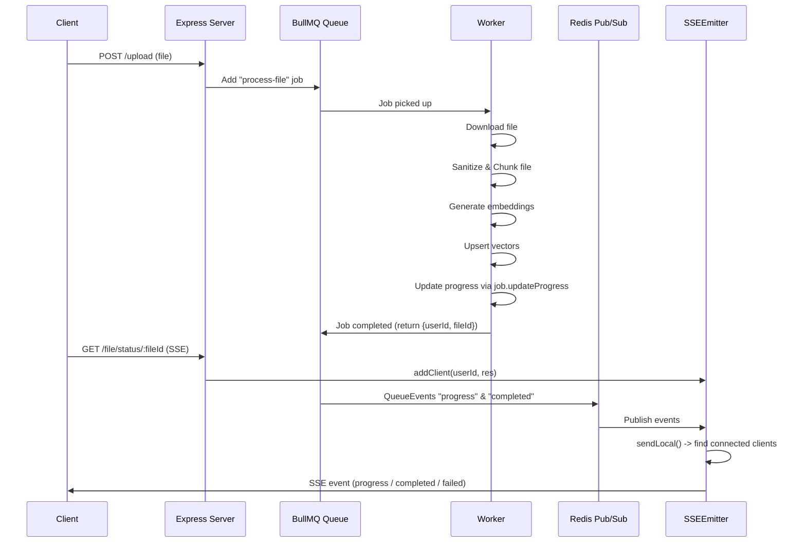

# 📄 AI Document Q&A App

This project is an **AI-powered document assistant** that allows users to upload documents and interact with them through a chatbot interface.

Users can ask natural language questions about the uploaded documents, and the chatbot provides relevant answers based on the document content.

---

## 🚀 Features

- **Document Upload** – Users can securely upload PDF, DOCX, and text files.
- **AI-Powered Q&A** – Chatbot answers questions using the uploaded documents as context.
- **File Processing Pipeline** – Documents are parsed, chunked, and embedded for efficient retrieval.
- **Contextual Search** – Uses embeddings + vector search to fetch the most relevant passages.
- **Chat Interface** – Natural conversation flow with memory for follow-up questions.
- **Cloud Storage** – Files are stored in S3-compatible storage (AWS S3 / Cloudflare R2).
- **Dockerized** – Fully containerized for easy deployment.

---

## 🛠️ Tech Stack

- **Backend**: Node.js (TypeScript, Express)
- **AI/LLM**: OpenAI API / local LLMs
- **Vector Store**: PostgreSQL + pgvector / Pinecone / Weaviate / ChromaDB
- **Storage**: S3 / Cloudflare R2
- **Frontend**: React / Vue (chat interface)
- **Containerization**: Docker & Docker Compose

---

## file upload flow



---

## 📦 Setup

```bash
# Clone repo
git clone <repo-url>
cd ai-doc-qa-app

# Install dependencies
npm install

# Start services
docker-compose up --build


## for dev
docker-compose -f docker-compose.dev.yml up --build -d

## for prod
docker-compose up --build -d


## for stopping
docker-compose down

## migrations
docker compose run --rm backend npx node-pg-migrate up
docker compose -f docker-compose.dev.yml run --rm backend npx node-pg-migrate up
```
