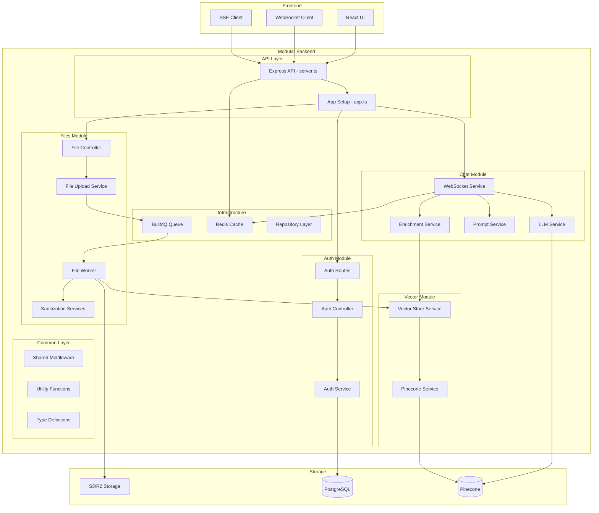

# 🏗️ Architecture Documentation

## System Overview

The AI Legal Document Q&A App is built with a modular, domain-driven architecture that separates concerns and enables scalable development. The system is designed to handle document processing, vector-based search, and AI-powered question answering.

## 🏗️ System Components



## 🔄 Service Interactions

### 1. File Upload Flow
- Client uploads file to Express API (`/modules/files/controllers/`)
- File saved to S3/R2 via file upload service
- Job queued in BullMQ for background processing
- File worker processes document (sanitization, chunking, embedding)
- Vector embeddings stored in Pinecone
- Metadata stored in PostgreSQL

### 2. Query Processing Flow
- Client sends question via WebSocket
- Question embedded using LLM service
- Vector similarity search in Pinecone
- Relevant context retrieved and formatted
- LLM generates answer based on context
- Response streamed back to client

### 3. Authentication Flow
- User credentials validated against PostgreSQL
- JWT tokens generated and validated
- Session management via Redis
- Role-based access control enforced

## 🏛️ Architecture Principles

### Domain-Driven Design
- **Auth Domain**: User authentication and authorization
- **Files Domain**: Document upload, processing, and management
- **Chat Domain**: Question answering and conversation management
- **Vector Domain**: Vector storage and similarity search

### Separation of Concerns
- **Controllers**: Handle HTTP requests and responses
- **Services**: Business logic and orchestration
- **Repositories**: Data access and persistence
- **Infrastructure**: External service integrations

### Modular Structure
```
src/
├── domains/           # Domain-specific modules
│   ├── auth/         # Authentication domain
│   ├── files/        # File management domain
│   ├── chat/         # Chat and Q&A domain
│   └── vector/       # Vector operations domain
├── infrastructure/   # External integrations
│   ├── database/     # Database repositories
│   ├── external-services/ # AI, search, storage
│   └── monitoring/   # Observability tools
└── shared/          # Common utilities
    ├── middleware/   # Express middleware
    ├── utils/       # Utility functions
    └── types/       # Type definitions
```

## 🔧 Technology Stack

### Backend
- **Runtime**: Node.js with TypeScript
- **Framework**: Express.js
- **Database**: PostgreSQL with pgvector extension
- **Cache**: Redis
- **Queue**: BullMQ
- **Storage**: MinIO/S3-compatible storage

### AI & ML
- **Vector Database**: Pinecone
- **Language Models**: Hugging Face Transformers
- **Embeddings**: Custom tokenizer and embedding service
- **Text Processing**: Xenova transformers

### Infrastructure
- **Containerization**: Docker & Docker Compose
- **Orchestration**: Kubernetes (optional)
- **Monitoring**: Prometheus & Grafana
- **Logging**: Structured logging with Pino

## 🚀 Development Workflow

### Local Development
1. **Environment Setup**: Use development Docker Compose
2. **Database**: PostgreSQL with vector extensions
3. **Services**: Redis, MinIO, and external APIs
4. **Hot Reload**: TypeScript compilation with watch mode

### Testing Strategy
- **Unit Tests**: Individual service and utility testing
- **Integration Tests**: API endpoint and service interaction testing
- **E2E Tests**: Full user workflow testing
- **Mock Services**: External service mocking for reliable testing

### Code Quality
- **TypeScript**: Strict type checking and interfaces
- **ESLint**: Code style and best practices enforcement
- **Prettier**: Consistent code formatting
- **Husky**: Pre-commit hooks for quality gates

## 📊 Performance Considerations

### Scalability
- **Horizontal Scaling**: Stateless services enable easy scaling
- **Queue Processing**: Background job processing for heavy operations
- **Caching**: Redis caching for frequently accessed data
- **Connection Pooling**: Database connection optimization

### Optimization
- **Vector Search**: Efficient similarity search with Pinecone
- **Chunking Strategy**: Optimal document chunking for retrieval
- **Streaming**: Real-time response streaming for better UX
- **Compression**: Response compression and optimization

### Monitoring
- **Metrics**: Prometheus metrics for system health
- **Logging**: Structured logging for debugging and analysis
- **Tracing**: Request tracing for performance analysis
- **Alerting**: Automated alerts for system issues

## 🔒 Security Architecture

### Authentication & Authorization
- **JWT Tokens**: Stateless authentication with secure tokens
- **Role-Based Access**: User permissions and access control
- **Session Management**: Secure session handling with Redis

### Data Protection
- **Input Validation**: Comprehensive input sanitization
- **SQL Injection Prevention**: Parameterized queries
- **XSS Protection**: Output encoding and CSP headers
- **SSRF Protection**: URL validation and filtering

### Infrastructure Security
- **TLS/SSL**: Encrypted communication
- **Secrets Management**: Secure credential storage
- **Network Security**: Firewall and access controls
- **Container Security**: Secure Docker configurations

## 🚀 Deployment Architecture

### Container Strategy
- **Multi-stage Builds**: Optimized Docker images
- **Service Separation**: Individual containers for each service
- **Health Checks**: Container health monitoring
- **Resource Limits**: CPU and memory constraints

### Environment Management
- **Development**: Local Docker Compose setup
- **Staging**: Production-like environment for testing
- **Production**: Kubernetes or Docker Swarm deployment
- **Secrets**: Environment-specific secret management

### CI/CD Pipeline
- **Build**: Automated Docker image building
- **Test**: Automated testing and quality checks
- **Deploy**: Automated deployment to environments
- **Monitor**: Post-deployment monitoring and alerting

## 📈 Future Architecture Considerations

### Microservices Evolution
- **Service Decomposition**: Further service separation as needed
- **API Gateway**: Centralized API management
- **Service Mesh**: Advanced service communication
- **Event-Driven**: Asynchronous event processing

### AI/ML Enhancements
- **Model Serving**: Dedicated ML model serving infrastructure
- **A/B Testing**: Model performance comparison
- **Feature Stores**: Centralized feature management
- **MLOps**: Machine learning operations pipeline

### Data Architecture
- **Data Lake**: Centralized data storage and processing
- **Stream Processing**: Real-time data processing
- **Data Pipeline**: ETL/ELT data processing workflows
- **Analytics**: Business intelligence and reporting
