# 📊 System Diagrams & User Flows

This document contains comprehensive Mermaid diagrams showing the important user flows, system architecture, and data flows of the AI Legal Document Q&A App.

## 🔄 Important User Flows

### Complete User Journey

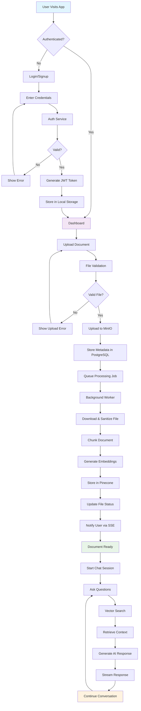

### Enhanced File Upload & Processing Flow

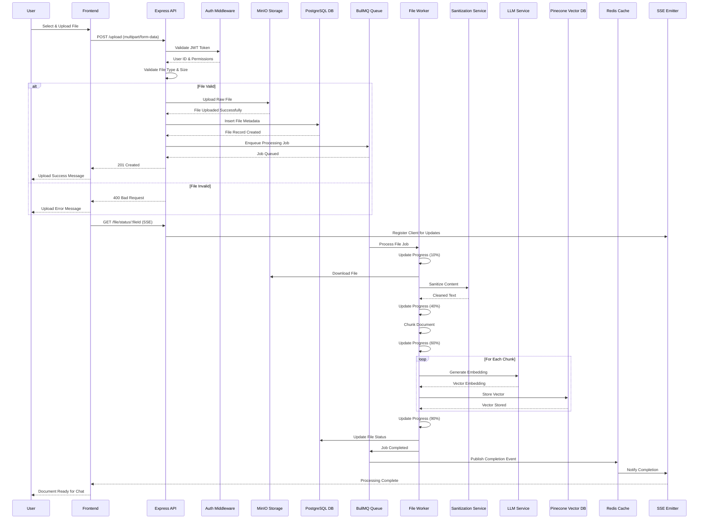

### Real-time Chat & Question Answering Flow

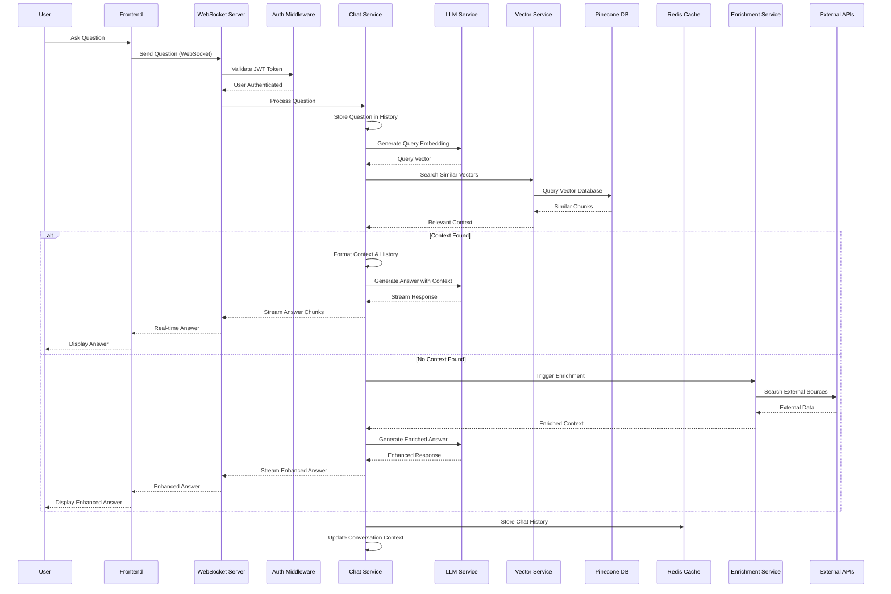

### Security & Authentication Flow

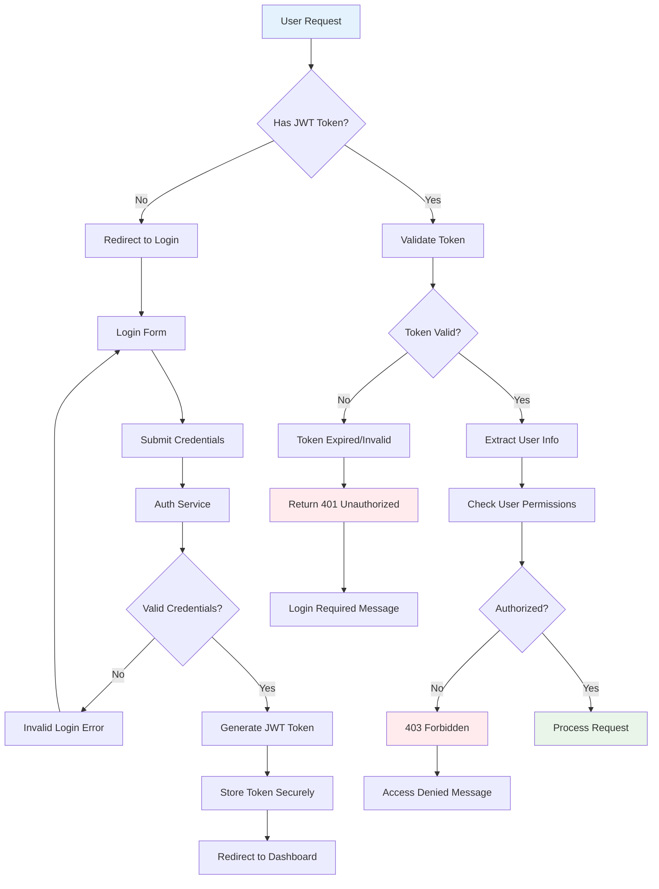

## 🏗️ System Architecture & Data Flow

### Comprehensive System Architecture

```mermaid
flowchart TB
    subgraph "Client Layer"
        UI[React Frontend]
        WS[WebSocket Client]
        SSE[SSE Client]
    end
    
    subgraph "API Gateway"
        LB[Load Balancer]
        API[Express API Server]
        MW[Middleware Layer]
    end
    
    subgraph "Authentication"
        JWT[JWT Validation]
        RBAC[Role-Based Access Control]
        SESS[Session Management]
    end
    
    subgraph "Core Services"
        subgraph "File Processing"
            FUP[File Upload Service]
            FPROC[File Processing Worker]
            SAN[Sanitization Service]
        end
        
        subgraph "AI Services"
            LLM[LLM Service]
            EMB[Embedding Service]
            PROMPT[Prompt Service]
        end
        
        subgraph "Chat Services"
            CHAT[Chat Service]
            ENRICH[Enrichment Service]
            HIST[Chat History Service]
        end
        
        subgraph "Search Services"
            VEC[Vector Search Service]
            SIM[Similarity Search]
            RANK[Relevance Ranking]
        end
    end
    
    subgraph "Data Layer"
        subgraph "Primary Storage"
            PG[(PostgreSQL)]
            REDIS[(Redis Cache)]
        end
        
        subgraph "File Storage"
            MINIO[MinIO/S3 Storage]
            CDN[Content Delivery Network]
        end
        
        subgraph "Vector Storage"
            PINECONE[(Pinecone Vector DB)]
            VECTORS[Vector Embeddings]
        end
    end
    
    subgraph "External Services"
        HF[Hugging Face API]
        SEARCH[Search APIs]
        WEB[Web Scraping]
    end
    
    subgraph "Queue System"
        BULLMQ[BullMQ Queue]
        WORKER[Background Workers]
        EVENTS[Event System]
    end
    
    subgraph "Monitoring"
        LOGS[Structured Logging]
        METRICS[Prometheus Metrics]
        ALERTS[Alert System]
    end
    
    UI --> LB
    WS --> LB
    SSE --> LB
    LB --> API
    API --> MW
    MW --> JWT
    JWT --> RBAC
    RBAC --> SESS
    
    API --> FUP
    API --> CHAT
    FUP --> BULLMQ
    BULLMQ --> FPROC
    FPROC --> SAN
    FPROC --> MINIO
    FPROC --> EMB
    EMB --> PINECONE
    
    CHAT --> LLM
    CHAT --> VEC
    VEC --> PINECONE
    VEC --> SIM
    SIM --> RANK
    
    CHAT --> ENRICH
    ENRICH --> SEARCH
    ENRICH --> WEB
    
    API --> PG
    API --> REDIS
    CHAT --> HIST
    HIST --> REDIS
    
    FPROC --> EVENTS
    EVENTS --> SSE
    
    API --> LOGS
    CHAT --> METRICS
    METRICS --> ALERTS
    
    style UI fill:#e1f5fe
    style API fill:#f3e5f5
    style PG fill:#e8f5e8
    style PINECONE fill:#fff3e0
    style MINIO fill:#fce4ec
```

### Domain-Driven Architecture

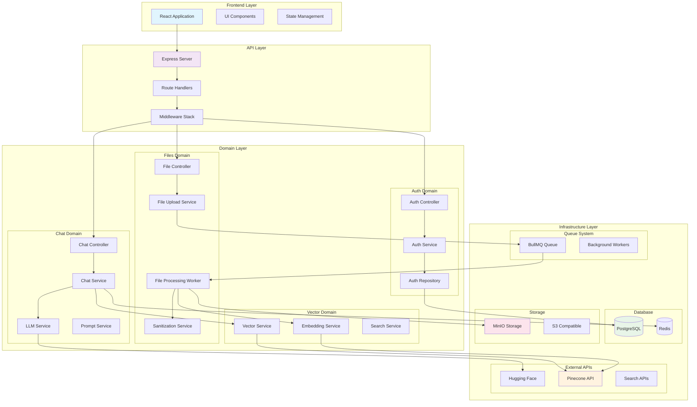

## 🔄 Data Flow Diagrams

### Document Processing Pipeline

```mermaid
flowchart LR
    A[Raw Document] --> B[File Upload]
    B --> C[Validation]
    C --> D[MinIO Storage]
    D --> E[Queue Job]
    E --> F[Background Worker]
    F --> G[Download File]
    G --> H[Sanitization]
    H --> I[Text Extraction]
    I --> J[Document Chunking]
    J --> K[Generate Embeddings]
    K --> L[Vector Storage]
    L --> M[Update Status]
    M --> N[Notify User]
    
    style A fill:#ffebee
    style N fill:#e8f5e8
    style L fill:#fff3e0
```

### Query Processing Pipeline

```mermaid
flowchart LR
    A[User Question] --> B[WebSocket Connection]
    B --> C[Authentication]
    C --> D[Generate Query Embedding]
    D --> E[Vector Search]
    E --> F[Retrieve Context]
    F --> G[Format Prompt]
    G --> H[LLM Generation]
    H --> I[Stream Response]
    I --> J[Update Chat History]
    J --> K[Return to User]
    
    style A fill:#e3f2fd
    style K fill:#e8f5e8
    style H fill:#fff3e0
```

## 🔒 Security Flow Diagrams

### Authentication & Authorization

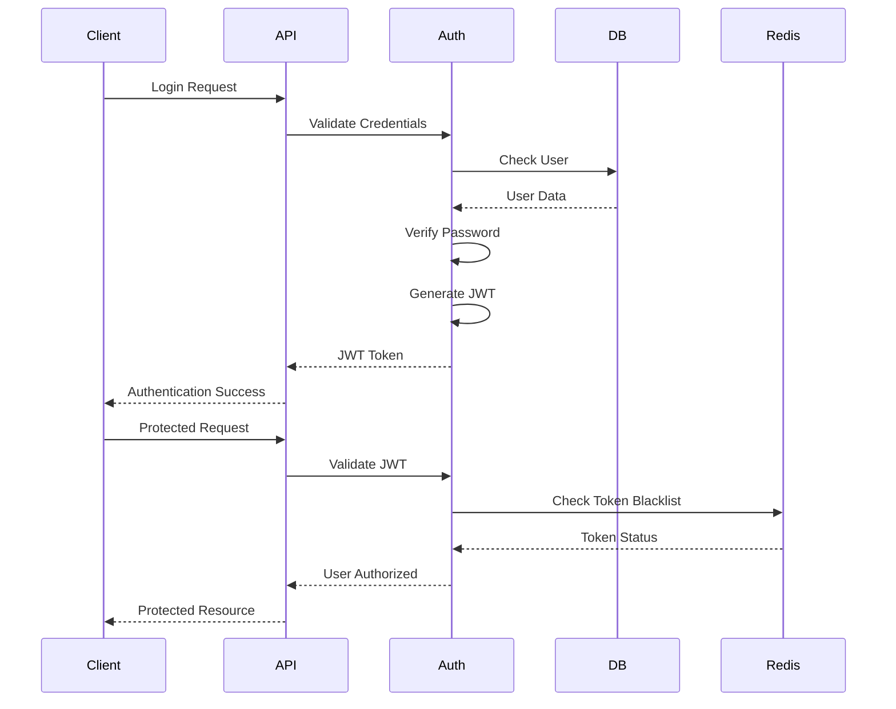

### File Security Flow

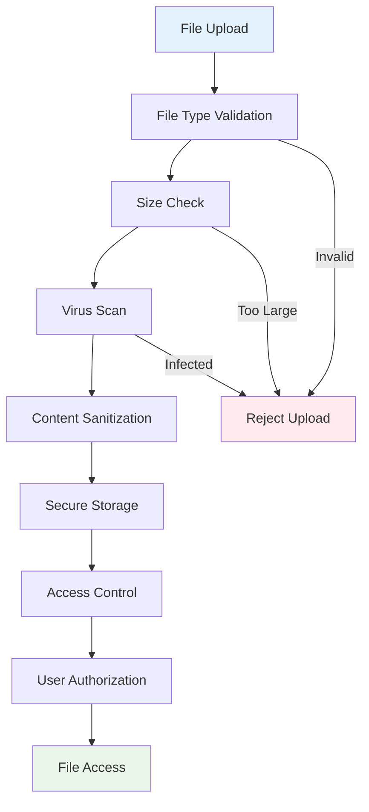

## 📊 Performance & Monitoring

### System Monitoring Flow

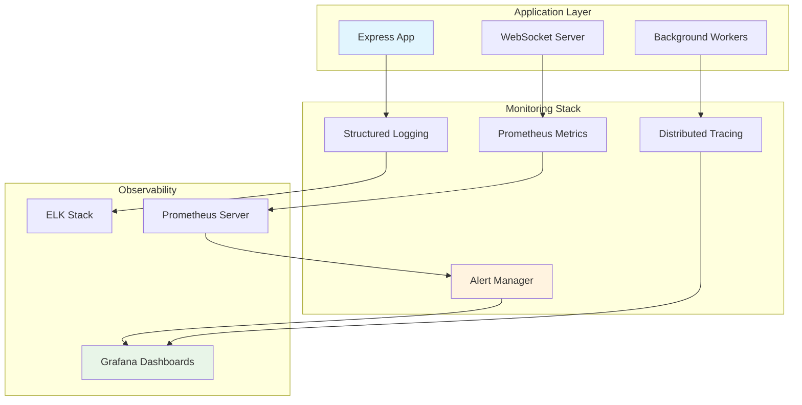

---

## 📚 Related Documentation

- [Architecture Guide](./ARCHITECTURE.md) - Detailed system architecture
- [API Documentation](./API.md) - Complete API reference
- [Features Guide](./FEATURES.md) - Feature capabilities and use cases
- [Setup Guide](./SETUP.md) - Installation and configuration
- [Security Analysis](./SECURITY_ANALYSIS.md) - Security considerations
