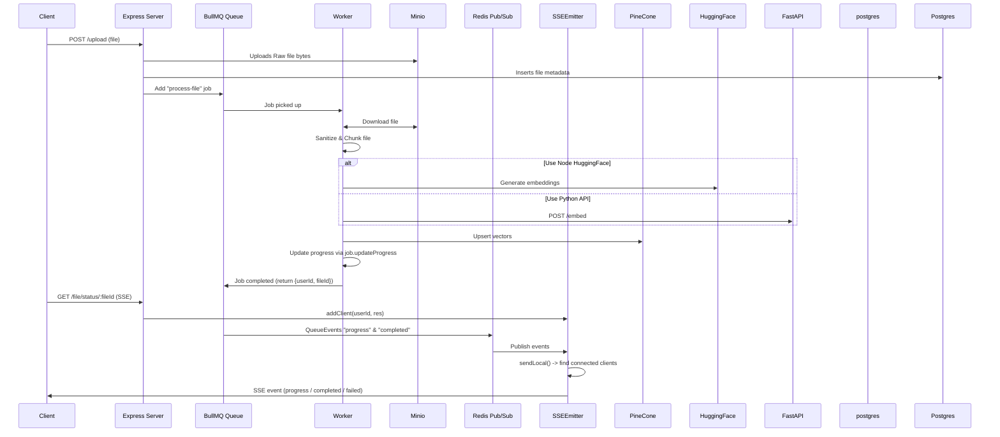
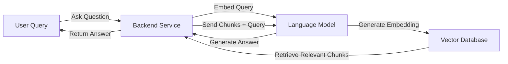
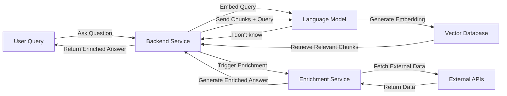

# 🚀 Features & Capabilities

## Overview

The AI Legal Document Q&A App is a comprehensive document analysis platform that combines advanced AI capabilities with secure document processing to provide intelligent question-answering functionality.

## 🎯 Core Features

### 📄 Document Upload & Processing
- **Multi-format Support**: Upload PDF, DOCX, and TXT files
- **Secure Storage**: Files stored in S3-compatible storage (AWS S3 / Cloudflare R2)
- **Intelligent Processing**: Documents are parsed, chunked, and embedded for efficient retrieval
- **Real-time Status**: Track processing progress via Server-Sent Events (SSE)
- **Background Processing**: Asynchronous file processing using BullMQ queues

### 🤖 AI-Powered Question Answering
- **Natural Language Queries**: Ask questions in plain English about your documents
- **Context-Aware Responses**: AI answers based solely on document content
- **Streaming Responses**: Real-time answer generation via WebSocket
- **Source Attribution**: Answers include references to specific document sections
- **Confidence Scoring**: AI provides confidence levels for its responses

### 🔍 Advanced Search & Retrieval
- **Vector-Based Search**: Uses embeddings and vector similarity for precise retrieval
- **Semantic Understanding**: Finds relevant content even with different wording
- **Multi-Document Queries**: Search across all your uploaded documents
- **Relevance Ranking**: Results ranked by semantic similarity and relevance

### 💬 Interactive Chat Interface
- **Conversational Flow**: Natural conversation with memory for follow-up questions
- **Real-time Communication**: WebSocket-based chat for instant responses
- **Chat History**: Persistent conversation history with automatic cleanup
- **Context Preservation**: Maintains conversation context across multiple questions

## 🛠️ Technical Features

### 🏗️ Modular Architecture
- **Domain-Driven Design**: Clean separation of concerns across modules
- **Scalable Structure**: Easy to add new features or modify existing ones
- **Type Safety**: Full TypeScript implementation with strict type checking
- **Test Coverage**: Comprehensive unit and integration tests

### 🔐 Security & Authentication
- **JWT Authentication**: Secure token-based authentication system
- **Role-Based Access**: User permissions and access control
- **Input Validation**: Comprehensive input sanitization and validation
- **Secure File Handling**: Protected file uploads with sanitization

### 📊 Performance & Scalability
- **Asynchronous Processing**: Non-blocking file processing and query handling
- **Caching Layer**: Redis-based caching for improved performance
- **Connection Pooling**: Optimized database connections
- **Horizontal Scaling**: Stateless services enable easy scaling

## 🔄 Workflow Features

### File Upload Flow

### Query Processing Flow

### Unknown Answer Handling

## ✅ Completed Features

### Authentication & Security
- [x] **JWT-based Authentication**: Secure login/signup with token validation
- [x] **Protected Routes**: Middleware-based route protection
- [x] **Input Sanitization**: XSS and injection attack prevention
- [x] **File Security**: Secure file upload with validation

### File Management
- [x] **Multi-format Upload**: Support for PDF, DOCX, and TXT files
- [x] **Background Processing**: Asynchronous file processing with BullMQ
- [x] **Progress Tracking**: Real-time processing status via SSE
- [x] **Metadata Storage**: File information stored in PostgreSQL
- [x] **Vector Embedding**: Documents converted to searchable vectors

### AI & Search
- [x] **Vector Search**: Pinecone-based similarity search
- [x] **LLM Integration**: Hugging Face transformers for text generation
- [x] **Context Retrieval**: Relevant document chunks for AI responses
- [x] **Multi-user Isolation**: User-specific document access
- [x] **Confidence Scoring**: AI response confidence levels

### Real-time Communication
- [x] **WebSocket Chat**: Real-time question-answering interface
- [x] **SSE Notifications**: File processing status updates
- [x] **Chat History**: Persistent conversation storage in Redis
- [x] **Streaming Responses**: Real-time answer generation

### Data Management
- [x] **PostgreSQL Integration**: Reliable data persistence
- [x] **Redis Caching**: Performance optimization
- [x] **S3 Storage**: Scalable file storage
- [x] **Vector Database**: Efficient similarity search

## 🚧 In Progress Features

### Enhanced AI Capabilities
- [ ] **Multi-language Support**: Support for documents in multiple languages
- [ ] **Advanced Summarization**: Document and section summarization
- [ ] **Legal Entity Recognition**: Automatic identification of legal entities
- [ ] **Contract Analysis**: Specialized legal contract analysis

### User Experience
- [ ] **Document Annotation**: User annotations and highlights
- [ ] **Collaborative Features**: Multi-user document sharing
- [ ] **Advanced Search**: Filters and search refinement options
- [ ] **Export Functionality**: Export conversations and analysis

### Performance & Scalability
- [ ] **CDN Integration**: Content delivery network for faster access
- [ ] **Advanced Caching**: Multi-level caching strategies
- [ ] **Load Balancing**: Horizontal scaling capabilities
- [ ] **Performance Monitoring**: Advanced metrics and monitoring

## 📝 Future Features

### AI Enhancements
- [ ] **Custom Models**: Fine-tuned models for specific legal domains
- [ ] **Multi-modal Support**: Image and table analysis in documents
- [ ] **Predictive Analytics**: Document risk assessment and predictions
- [ ] **Automated Insights**: Automatic document analysis and insights

### Integration & APIs
- [ ] **Third-party Integrations**: CRM and legal software integrations
- [ ] **Webhook Support**: Event-driven integrations
- [ ] **API Rate Limiting**: Advanced rate limiting and quotas
- [ ] **SDK Development**: Client libraries for popular languages

### Enterprise Features
- [ ] **Multi-tenancy**: Support for multiple organizations
- [ ] **Advanced Permissions**: Granular access control
- [ ] **Audit Logging**: Comprehensive activity tracking
- [ ] **Compliance Tools**: GDPR, HIPAA compliance features

## 🎯 Use Cases

### Legal Professionals
- **Contract Analysis**: Quickly analyze contract terms and obligations
- **Case Research**: Find relevant precedents and legal references
- **Document Review**: Efficiently review large document sets
- **Client Consultation**: Provide quick answers based on document content

### Business Users
- **Policy Review**: Understand company policies and procedures
- **Compliance Checking**: Ensure adherence to regulatory requirements
- **Document Search**: Find specific information across multiple documents
- **Knowledge Management**: Build searchable knowledge bases

### Educational Institutions
- **Research Assistance**: Help students analyze legal documents
- **Case Study Analysis**: Interactive case study exploration
- **Legal Education**: Practical legal document analysis training
- **Academic Research**: Support for legal research projects

## 🔧 Technical Specifications

### Supported File Formats
- **PDF**: Portable Document Format with text extraction
- **DOCX**: Microsoft Word documents
- **TXT**: Plain text files with UTF-8 encoding

### File Size Limits
- **Maximum File Size**: 10MB per file
- **Processing Time**: Typically 30-60 seconds for standard documents
- **Vector Storage**: Optimized for documents up to 100 pages

### Performance Metrics
- **Query Response Time**: < 2 seconds for most queries
- **File Processing**: 1-2 minutes for typical legal documents
- **Concurrent Users**: Supports 100+ simultaneous users
- **Uptime**: 99.9% availability target

## 🚀 Getting Started

1. **Upload Documents**: Start by uploading your legal documents
2. **Wait for Processing**: Documents are automatically processed and indexed
3. **Ask Questions**: Use natural language to query your documents
4. **Get Insights**: Receive AI-powered answers with source references

For detailed setup instructions, see the [Setup Guide](./SETUP.md) and [API Documentation](./API.md).
